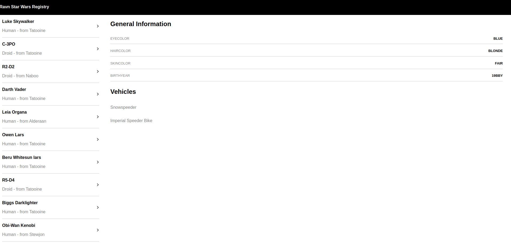

# Demo

This project shows a basic connection between graphql and react js

## Getting Started


### Prerequisites
  - Node v8.11.4

### Installing

```
yarn 
yarn start
```

 ## Built With

* [react native](http://www.dropwizard.io/1.0.2/docs/) 
* [graphQl](https://api.graphql.jobs/) - Jobs
* [react navigation](https://reactnavigation.org/) v4

## Result Screens



## Authors

* **Kamaly Zapana**

## License

This project is licensed under the MIT License - see the [LICENSE.md](LICENSE.md) file for details
